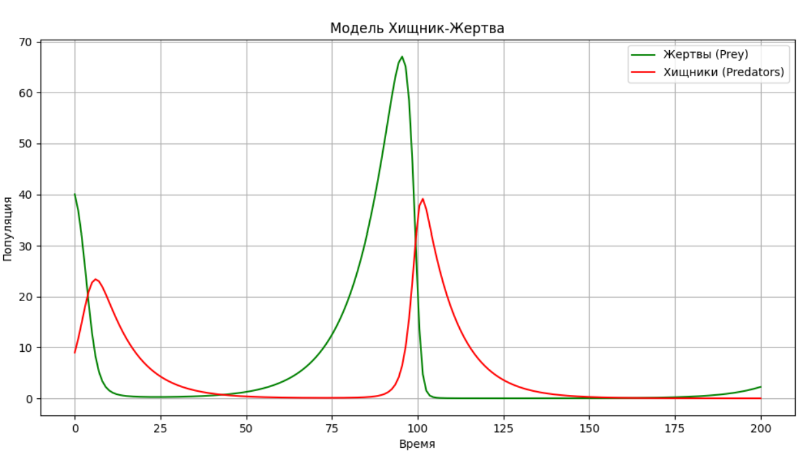

---
## Front matter
title: "Первоначальное исследование модели Лотки-Вольтерры"
author: "Коннова Татьяна Алексеевна"

## Generic otions
lang: ru-RU
toc-title: "Содержание"

## Bibliography
bibliography: bib/cite.bib
csl: pandoc/csl/gost-r-7-0-5-2008-numeric.csl

## Pdf output format
toc: true # Table of contents
toc-depth: 2
lof: true # List of figures
lot: true # List of tables
fontsize: 12pt
linestretch: 1.5
papersize: a4
documentclass: scrreprt
## I18n polyglossia
polyglossia-lang:
  name: russian
  options:
	- spelling=modern
	- babelshorthands=true
polyglossia-otherlangs:
  name: english
## I18n babel
babel-lang: russian
babel-otherlangs: english
## Fonts
mainfont: IBM Plex Serif
romanfont: IBM Plex Serif
sansfont: IBM Plex Sans
monofont: IBM Plex Mono
mathfont: STIX Two Math
mainfontoptions: Ligatures=Common,Ligatures=TeX,Scale=0.94
romanfontoptions: Ligatures=Common,Ligatures=TeX,Scale=0.94
sansfontoptions: Ligatures=Common,Ligatures=TeX,Scale=MatchLowercase,Scale=0.94
monofontoptions: Scale=MatchLowercase,Scale=0.94,FakeStretch=0.9
mathfontoptions:
## Biblatex
biblatex: true
biblio-style: "gost-numeric"
biblatexoptions:
  - parentracker=true
  - backend=biber
  - hyperref=auto
  - language=auto
  - autolang=other*
  - citestyle=gost-numeric
## Pandoc-crossref LaTeX customization
figureTitle: "Рис."
tableTitle: "Таблица"
listingTitle: "Листинг"
lofTitle: "Список иллюстраций"
lotTitle: "Список таблиц"
lolTitle: "Листинги"
## Misc options
indent: true
header-includes:
  - \usepackage{indentfirst}
  - \usepackage{float} # keep figures where there are in the text
  - \floatplacement{figure}{H} # keep figures where there are in the text
---

# Цель работы

Цель данной работы заключается в исследовании динамики взаимодействия популяций хищников и жертв с использованием модели Лотки-Вольтерры, которая представляет собой математическую абстракцию, позволяющую понять сложные экосистемные процессы.

# Рассматриваемые статьи

Использование математических моделей в экологии при компьютерном моделирование системы "хищник - жертва" [@lotka_3].

Математическая модель "ХИЩНИК - ЖЕРТВА" [@lotka_2].

Об одной модели динамики популяций "хищник - жертва" [@lotka_1].


# Краткий экскурс по статьям

В статьях рассматривается модель «хищник-жертва», известная как модель Лотки-Вольтерры, которая изучает взаимодействие популяций хищников и жертв и их изменение со временем. Основная проблема заключается в сложности аналитического решения, позволяющего точно предсказать численность этих видов в определённый момент. Модель описывает, как увеличение количества жертв ведет к росту популяции хищников, что затем приводит к уменьшению численности жертв и, соответственно, хищников, создавая циклические колебания.

Кроме биологических взаимодействий, модель также применяется в социально-экономических исследованиях, описывая динамику популяций в условиях ограниченных ресурсов и в контексте природопользования. В демографическом контексте жертвой может выступать население, а хищником – социальная среда, что позволяет использовать эту модель для анализа социально-экономической динамики.

# Теоретическое введение

## Модель Лотки-Вольтерра

Модель Лотки-Вольтерра, также известная как уравнения хищник-жертва, описывает динамику взаимодействия между двумя видами: хищниками и жертвами. Эта модель была разработана итальянским математиком Виторио Лоткой и американским биологом Альфредом Вольтеррой в начале 20 века.

## Основные положения модели:

1. **Жертвы** (например, кролики) размножаются экспоненциально, если хищников нет. Их популяция растет, пока есть достаточно ресурсов.

2. **Хищники** (например, волки) зависят от наличия жертв. Когда жертв много, хищники могут размножаться и их популяция растет. Однако, если жертв становится недостаточно, популяция хищников начинает уменьшаться.

## Модель взаимодействия хищников и жертв

Популяция жертв изменяется по уравнению:

$$
\frac{dX}{dt} = \alpha X - \beta XY
$$

где:
- $X$ — популяция жертв
- $Y$ — популяция хищников
- $\alpha$ — коэффициент размножения жертв
- $\beta$ — коэффициент взаимодействия (уменьшение жертв из-за хищников)

## Динамика системы:

- **Циклы**: Популяции жертв и хищников колеблются в циклах. Когда количество жертв увеличивается, хищники тоже начинают размножаться, но затем количество жертв уменьшается, что приводит к снижению популяции хищников.
- **Стабильность**: Модель показывает, что популяции могут достигать устойчивого состояния, но также может быть и хаотичное поведение в зависимости от начальных условий.

## Применение:

Модель Лотки-Вольтерра находит применение в экологии, экономике (например, в моделировании конкуренции), а также в других областях, где происходит взаимодействие между двумя популяциями.

Эта модель является основой для понимания сложных экосистем и взаимодействий в природе.

## Код модели на Python

```python
import numpy as np
import matplotlib.pyplot as plt

# Параметры модели
alpha = 0.1  # коэффициент размножения жертв
beta = 0.02  # коэффициент смертности жертв от хищников
delta = 0.01  # коэффициент размножения хищников
gamma = 0.1   # коэффициент смертности хищников

# Начальные условия
prey_initial = 40   # начальное количество жертв
predator_initial = 9  # начальное количество хищников
time_steps = 200     # количество временных шагов

# Временная сетка
t = np.linspace(0, time_steps, time_steps)

# Массивы для хранения значений популяций
prey_population = np.zeros(time_steps)
predator_population = np.zeros(time_steps)

# Установка начальных условий
prey_population[0] = prey_initial
predator_population[0] = predator_initial

# Моделирование динамики популяций
for i in range(1, time_steps):
    prey_population[i] = prey_population[i-1] + (alpha * prey_population[i-1] - beta * prey_population[i-1] * predator_population[i-1])
    predator_population[i] = predator_population[i-1] + (delta * prey_population[i-1] * predator_population[i-1] - gamma * predator_population[i-1])

# Визуализация результатов
plt.figure(figsize=(12, 6))
plt.plot(t, prey_population, label='Жертвы (Prey)', color='green')
plt.plot(t, predator_population, label='Хищники (Predators)', color='red')
plt.title('Модель Хищник-Жертва')
plt.xlabel('Время')
plt.ylabel('Популяция')
plt.legend()
plt.grid()
plt.show()
```

{#fig:001 width=70%}

# Выводы

В рамках выполнения данной работы выполнено ознакомление с моделью "хищник-жертва".

# Список литературы{.unnumbered}

::: {#refs}
:::
