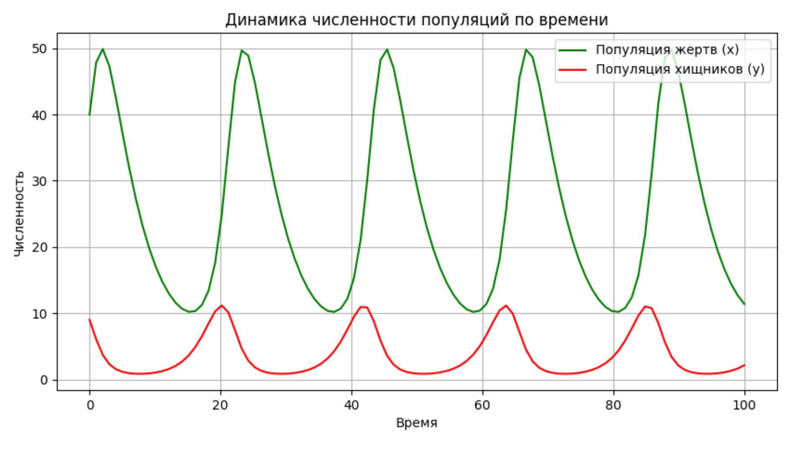
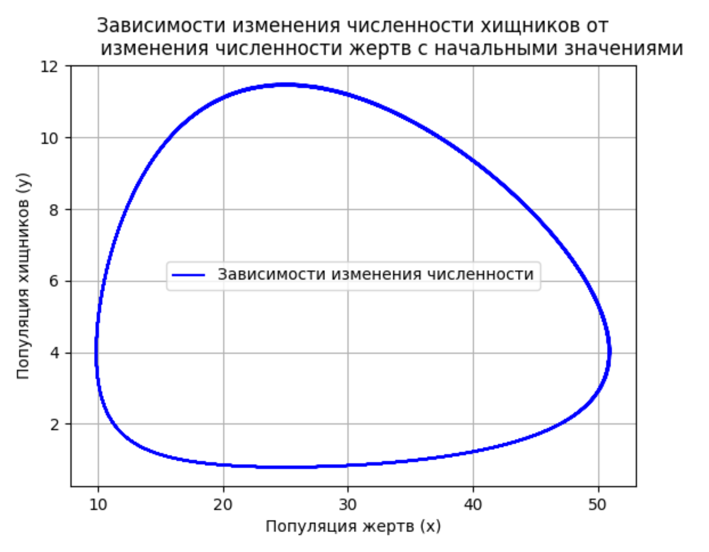

---
## Front matter
title: "Математическая модель «хищник–жертва»"
subtitle: "Построение с помощью python"
author: "Коннова Татьяна Алексеевна"
## Generic otions
lang: ru-RU
toc-title: "Содержание"

## Bibliography
bibliography: bib/cite.bib
csl: pandoc/csl/gost-r-7-0-5-2008-numeric.csl

## Pdf output format
toc: true # Table of contents
toc-depth: 2
lof: true # List of figures
lot: false # List of tables
fontsize: 12pt
linestretch: 1.5
papersize: a4
documentclass: scrreprt
## I18n polyglossia
polyglossia-lang:
  name: russian
  options:
	- spelling=modern
	- babelshorthands=true
polyglossia-otherlangs:
  name: english
## I18n babel
babel-lang: russian
babel-otherlangs: english
## Fonts
mainfont: PT Serif
romanfont: PT Serif
sansfont: PT Sans
monofont: PT Mono
mainfontoptions: Ligatures=TeX
romanfontoptions: Ligatures=TeX
sansfontoptions: Ligatures=TeX,Scale=MatchLowercase
monofontoptions: Scale=MatchLowercase,Scale=0.9
## Biblatex
biblatex: true
biblio-style: "gost-numeric"
biblatexoptions:
  - parentracker=true
  - backend=biber
  - hyperref=auto
  - language=auto
  - autolang=other*
  - citestyle=gost-numeric
## Pandoc-crossref LaTeX customization
figureTitle: "Рис."
tableTitle: "Таблица"
listingTitle: "Листинг"
lofTitle: "Список иллюстраций"
lotTitle: "Список таблиц"
lolTitle: "Листинги"
## Misc options
indent: true
header-includes:
  - \usepackage{indentfirst}
  - \usepackage{float} # keep figures where there are in the text
  - \floatplacement{figure}{H} # keep figures where there are in the text
---
# Аннотация
  В данной работе рассматривается построение математической модели «хищник–жертва» с использованием языка программирования Python. 
  Модель основана на системе дифференциальных уравнений Лотки-Вольтерры и визуализирована с помощью библиотек NumPy и Matplotlib.
  Исследуется динамика популяций хищников и жертв при различных начальных условиях.

# Введение

Исследование динамики численности популяций хищников и жертв с течением времени, а также анализ зависимости изменения численности хищников от изменения численности жертв с заданными начальными условиями.
Проблема взаимодействия хищников и жертв впервые получила математическое описание в работах Альфреда Лотки (1925 г.) и Вито Вольтерры (1926 г.), которые независимо друг от друга разработали систему дифференциальных уравнений, известную сегодня как модель Лотки-Вольтерры. Эти исследования были вызваны необходимостью объяснения колебаний численности рыб в Средиземном море, наблюдавшихся итальянскими биологами после Первой мировой войны.

Модель совместного существования двух биологических видов (популяций) типа «хищник — жертва» называется также моделью Вольтерры — Лотки.

Была впервые получена Альфредом Лоткой в 1925 году (использовал для описания динамики взаимодействующих биологических популяций).

В 1926 году (независимо от Лотки) аналогичные (и более сложные) модели были разработаны итальянским математиком Вито Вольтеррой. Его глубокие исследования в области экологических проблем создали основу математической теории биологических сообществ (математической экологии).
Модель Лотки-Вольтерры описывает взаимодействие двух видов в экосистеме [@гасратова2014математическая], [@шубина2016одной]:

- **Жертвы**: размножаются с постоянной скоростью, но их численность ограничивается хищниками
- **Хищники**: вымирают без жертв, но увеличивают популяцию за счет поедания жертв

# Методы

В данной работе используется классическая математическая модель хищник-жертва, основанная на системе дифференциальных уравнений Лотки-Вольтерры. Для описания динамики популяций жертв и хищников применяются две взаимосвязанные функции, отражающие скорость роста популяции жертв при отсутствии хищников и скорость убыли популяции хищников при отсутствии пищи. Модель включает параметры, характеризующие коэффициенты рождаемости, смертности и интенсивность взаимодействия между видами. Решение системы уравнений осуществляется численными методами, такими как метод Рунге-Кутты четвёртого порядка, что позволяет исследовать поведение системы во времени при различных начальных условиях и параметрах. Анализ устойчивости равновесных точек проводится с помощью линейного приближения и вычисления собственных значений якобиана системы.

Основные уравнения модели [@гладких2015математическая], [@громазина2017использование]:

$$
\begin{cases}
  \dot x = ax - bxy \\
  \dot y = cxy - dy,
\end{cases}
$$

a, d, - коэффициенты смертности
b, c, - коэффициенты прироста популяции

# Результаты

**Код для построения графика динамики численности популяций по времени: **

```python
import numpy as np
import matplotlib.pyplot as plt
from scipy.integrate import odeint

# Параметры модели
a = 0.2   # коэффициент прироста жертв
b = 0.5  # коэффициент смертности жертв из-за хищников
c = 0.05  # коэффициент прироста хищников из-за жертв
d = 0.02   # коэффициент смертности хищников

# Сист. ур.
def model(populations, t):
    x, y = populations  # x - популяция жертв, y - популяция хищников
    dxdt = -a * x + c * x * y  # изменение популяции жертв
    dydt = -d * x * y + b * y   # изменение популяции хищников
    return [dxdt, dydt]

# Нач. условия
initial_conditions = [40, 9]  # начальные значения (жертвы, хищники)
t = np.linspace(0, 100, 100)  # временной интервал

# Решение дифф. ур.
solution = odeint(model, initial_conditions, t)

# Извлечение значений популяций
x_population = solution[:, 0]  # популяция жертв
y_population = solution[:, 1]  # популяция хищников

plt.figure(figsize=(10, 5))
plt.plot(t, x_population, label='Популяция жертв (x)', color='green')
plt.plot(t, y_population, label='Популяция хищников (y)', color='red')
plt.xlabel('Время')
plt.ylabel('Численность')
plt.title('Динамика численности популяций по времени.')
plt.legend()
plt.grid()
plt.show()
```
Результат:



Далее построим с помощью python график, отражающий зависимости изменения численности хищников от изменения численности жертв с начальными значениями:

```python
import numpy as np
import matplotlib.pyplot as plt
from scipy.integrate import odeint

# Параметры модели
a = 0.2   # коэффициент прироста жертв
b = 0.5  # коэффициент смертности жертв из-за хищников
c = 0.05  # коэффициент прироста хищников из-за жертв
d = 0.02   # коэффициент смертности хищников

# Система уравнений
def model(populations, t):
    x, y = populations  # x - популяция жертв, y - популяция хищников
    dxdt = -a * x + c * x * y  # изменение популяции жертв
    dydt = -d * x * y + b * y   # изменение популяции хищников
    return [dxdt, dydt]

# Функция для построения графика
def plot_population_graph(initial_conditions, time_range):
    t = np.linspace(time_range[0], time_range[1], 1000)  # временной интервал
    solution = odeint(model, initial_conditions, t)

    x_population = solution[:, 0]  # популяция жертв
    y_population = solution[:, 1]  # популяция хищников

    # Построение графика
    plt.figure()
    plt.plot(x_population, y_population, label='''Зависимости изменения 
    численности''', color='blue')
    plt.xlabel('Популяция жертв (x)')
    plt.ylabel('Популяция хищников (y)')
    plt.title('''Зависимости изменения численности хищников 
    от изменения численности жертв с начальными значениями''')
    plt.grid()
    plt.legend()
    plt.show()

# Начальные условия
initial_conditions = [10, 5]  # начальные значения (жертвы, хищники)
time_range = (0, 400)  # временной диапазон

# Вызов функции для построения графика
plot_population_graph(initial_conditions, time_range)
```

Результат:



# Выводы

В процессе выполнения данной лабораторной работы была реализована модель "хищник-жертва" на языке программирования Python. Данная модель основана на системе дифференциальных уравнений Лотки-Вольтерры и была визуализирована с помощью библиотек NumPy и Matplotlib.
В рамках данной работы была исследована динамика популяций хищников и жертв при различных начальных условиях. Была построена математическая модель, которая позволяет описать взаимодействие между двумя видами и исследовать влияние различных факторов на динамику популяций.

# Список литературы{.unnumbered}

::: {#refs}
:::