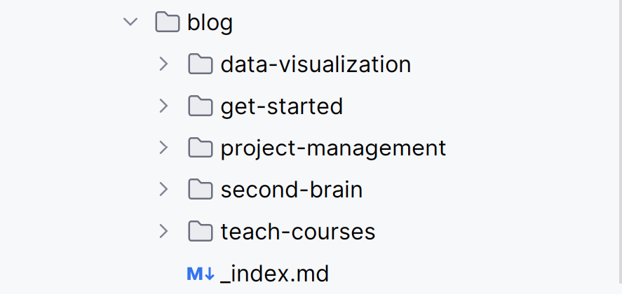
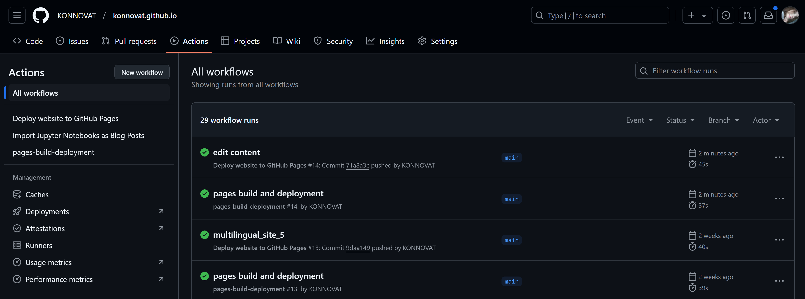

---
## Front matter
title: "Создание и развертывание персонального сайта с многоязычной поддержкой на GitHub Pages"
subtitle: "Разработка и деплой персонального сайта на GitHub Pages с поддержкой многоязычности"
author: "Коннова Татьяна Алексеевна"

## Generic otions
lang: ru-RU
toc-title: "Содержание"

## Bibliography
bibliography: bib/cite.bib
csl: pandoc/csl/gost-r-7-0-5-2008-numeric.csl

## Pdf output format
toc: true # Table of contents
toc-depth: 2
lof: true # List of figures
lot: true # List of tables
fontsize: 12pt
linestretch: 1.5
papersize: a4
documentclass: scrreprt
## I18n polyglossia
polyglossia-lang:
  name: russian
  options:
	- spelling=modern
	- babelshorthands=true
polyglossia-otherlangs:
  name: english
## I18n babel
babel-lang: russian
babel-otherlangs: english
## Fonts
mainfont: IBM Plex Serif
romanfont: IBM Plex Serif
sansfont: IBM Plex Sans
monofont: IBM Plex Mono
mathfont: STIX Two Math
mainfontoptions: Ligatures=Common,Ligatures=TeX,Scale=0.94
romanfontoptions: Ligatures=Common,Ligatures=TeX,Scale=0.94
sansfontoptions: Ligatures=Common,Ligatures=TeX,Scale=MatchLowercase,Scale=0.94
monofontoptions: Scale=MatchLowercase,Scale=0.94,FakeStretch=0.9
mathfontoptions:
## Biblatex
biblatex: true
biblio-style: "gost-numeric"
biblatexoptions:
  - parentracker=true
  - backend=biber
  - hyperref=auto
  - language=auto
  - autolang=other*
  - citestyle=gost-numeric
## Pandoc-crossref LaTeX customization
figureTitle: "Рис."
tableTitle: "Таблица"
listingTitle: "Листинг"
lofTitle: "Список иллюстраций"
lotTitle: "Список таблиц"
lolTitle: "Листинги"
## Misc options
indent: true
header-includes:
  - \usepackage{indentfirst}
  - \usepackage{float} # keep figures where there are in the text
  - \floatplacement{figure}{H} # keep figures where there are in the text
---

# Цель работы

Целью данной работы является ознакомление с базовыми знаниями по yaml, создание и развертывание персонального сайта на платформе GitHub Pages, который будет служить интерактивной витриной для представления информации о себе и публикации постов. Сайт будет иметь возможность переключения между двумя языковыми версиями, что обеспечит доступность контента для более широкой аудитории. Для достижения этой цели будет разработан функционал, позволяющий пользователям легко переключаться между языками, при этом перевод элементов интерфейса и контента будет осуществляться отдельно, что позволит поддерживать актуальность и точность информации на обоих языках.

# Задание

В рамках данного задания необходимо разработать и развернуть персональный сайт на платформе GitHub Pages. Сайт должен содержать информацию о себе, а также посты, которые могут быть представлены в двух языковых версиях.

Основные задачи задания включают:

- Планирование структуры сайта

Реализовать возможность переключения между языковыми версиями сайта, чтобы пользователи могли легко выбирать нужный язык.

- Деплой на GitHub Pages

Ознакомиться с процессом размещения сайта на GitHub Pages, включая создание репозитория, настройку необходимых файлов и публикацию сайта.

В табл. [-@tbl:std-dir] приведено краткое описание задач данной работы.

: Описание задач {#tbl:std-dir}

| Задание                                      | Описание задания                                                                                                                          |
|----------------------------------------------|-------------------------------------------------------------------------------------------------------------------------------------------|
| `Планирование структуры сайта`               | Определить основные разделы и элементы, которые будут включены в сайт, такие как "О себе", "Посты", "Контакты" и другие.                  |
| `Создание контента `                         | Написать тексты для каждого раздела на обоих языках, обеспечивая точность и соответствие перевода.                                        |
| `Разработка функционала переключения языков` | Реализовать возможность переключения между языковыми версиями сайта, чтобы пользователи могли легко выбирать нужный язык.                 |
| `Деплой на GitHub Pages`                     | Ознакомиться с процессом размещения сайта на GitHub Pages, включая создание репозитория, настройку необходимых файлов и публикацию сайта. |


# Теоретическое введение

**История GitHub Pages**

GitHub Pages был запущен в 2010 году как способ для пользователей GitHub размещать свои статические веб-сайты. Это стало возможным благодаря интеграции с системой контроля версий Git, что позволило разработчикам легко управлять версиями своих сайтов и вносить изменения. Изначально GitHub Pages использовался в основном для размещения документации проектов, но со временем его возможности расширились, и он стал популярным среди разработчиков, блогеров и дизайнеров для создания персональных сайтов и портфолио.

**Деплой на GitHub Pages**

GitHub Pages позволяет пользователям деплоить статические веб-сайты, используя репозитории GitHub. Это означает, что вы можете хранить все файлы вашего сайта (HTML, CSS, JavaScript и изображения) в репозитории, а GitHub автоматически генерирует и обслуживает сайт на основе этих файлов. Основные концепции включают:

**Статические сайты**

GitHub Pages подходит для статических сайтов, то есть сайтов, которые не требуют серверной обработки (например, динамического контента).

**Git**

Использование системы контроля версий Git позволяет отслеживать изменения в коде сайта, что упрощает совместную работу и управление версиями.

**Сайты пользователя и проектные сайты**

GitHub Pages поддерживает два типа сайтов:

**Пользовательские сайты**

Создаются на основе репозиториев с именем repo-name.github.io.

**Проектные сайты** 

Создаются в других репозиториях и могут быть доступны по адресу repo-name.github.io/repository-name.

Более подробно про Git см. в [@chacon_book_pro_git_en].

# Основы YAML

YAML (YAML Ain\'t Markup Language) --- это формат сериализации данных,
который широко используется для конфигурационных файлов и обмена
данными.

## Основные характеристики YAML

**Читаемость** 

YAML разрабатывался с акцентом на простоту чтения
человеком.

**Структурированные данные** 

Позволяет создавать сложные
структуры данных с помощью отступов и иерархии.

**Совместимость**

YAML хорошо работает с различными языками
программирования.

## Синтаксис YAML

### Основные элементы

**Строки**
```yaml
shopping: [milk, eggs, juice]
```

**Ключ-значение**

```yaml

имя: Иван

возраст: 25
```

**Списки**
```yaml
shopping: 
- milk
- eggs
- juice
```
**Словари**
```yaml
Employees: 
- dan:
    name: Dan D. Veloper
    job: Developer
    team: DevOps
- dora:
   name: Dora D. Veloper
   job: Project Manager
   team: Web Subscriptions
```

**Структура данных**

Данные могут быть организованы с помощью отступов, что позволяет
создавать вложенные структуры:
```yaml
семья:
- имя: Иван
возраст: 30
- имя: Анна
возраст: 28
```
**Комментарии**

Комментарии начинаются с символа #:
```yaml
# Это комментарий
```

```yaml
имя: Иван # Имя пользователя
```
**Многострочные строки**

Для многострочных строк можно использовать | или >:

```yaml
str: Hello World
data: |
   Это
   Отдельные
   Строки
data: >
   Это 
   один параграф
   текста
```
**Поддержка мультидокументов**

YAML позволяет хранить несколько документов в одном файле, разделяя их с
помощью ---:
```yaml
---
player: playerOne
action: attack (miss)
---
player: playerTwo
action: attack (hit)
---
```
**Поддержка якорей**

Якоря позволяют ссылаться на уже определенные значения, что упрощает
повторное использование данных:
```yaml
default: &default_settings
  language: English
  country: Russia

user1:
  <<: *default_settings
  name: Alice

user2:
  <<: *default_settings
  name: Ivan
```

**Явная и неявная типизация**

YAML предлагает как автоопределение типов, так и возможность явно указать тип данных. Чтобы использовать конкретный тип, нужно написать !![тип] перед значением.
```yaml
# Это значение преобразуется в int:
is-an-int: !!int 14.10
# Превращает любое значение в строку:
is-a-str: !!str 67.43
# Значение должно быть boolean:
is-a-bool: !!bool yes
```
**Шаблоны**

YAML поддерживает создание шаблонов данных, что особенно полезно при работе с конфигурационными файлами для контейнеризации (например, в Docker) или при написании сценариев для таких инструментов, как Ansible и Kubernetes. Шаблоны позволяют повторно использовать часто встречающиеся структуры данных и упрощают управление конфигурацией.

Например, в Docker Compose файле YAML можно создать шаблон для конфигурации нескольких контейнеров:
```yaml
services:
  webapp: &app
    image: myapp:latest
    environment:
      - DATABASE_URL=mysql://db:3306/mydb
  api:
    <<: *app
    ports:
      - "8000:8000"
  worker:
    <<: *app
    command: celery -A app worker
```

**Применение YAML**

Конфигурационные файлы - наиболее распространенное применение YAML.

Обмен данными - используется как формат обмена данными между различными
системами.

Инфраструктура как код - широко применяется в DevOps для описания
инфраструктуры.

**Расширенные типы данных**

YAML поддерживает различные расширенные типы данных, такие как:

-   **Timestamp**

-   **дата**:
2023-10-05T14:48:00Z

-   **Null**:
значение: null

-   **Boolean**:
активен: true

-   **Integer и Float**:
целое_число: 42
дробное_число: 3.14

```yaml
integer: 25
hex: 0x12d4 #равно 4820
octal: 023332 #равно 9946
float: 25.0
exponent: 12.3015e+05 #равно 1230150.0
boolean: Yes
string: "25"
infinity: .inf # преобразуется в бесконечность
neginf: -.Inf #преобразуется в минус бесконечность
not: .NAN #Not a Number
null: ~
```

Более подробно про YAML см. в [@tarun_book_yaml_en], [@quattro_book_yaml_en].

# Выполнение работы

Для начала зайдем на сайт репозитория https://github.com/HugoBlox/theme-blog (рис. [-@fig:001]).

{#fig:001 width=70%}

Создадим собственный репозиторий по шаблону Hugo.

{#fig:002 width=70%}

Зададим имя будущему сайту.

{#fig:003 width=70%}

Затем склонируем репозиторий для локального редактирования собственного контента и последующих коммитов + деплоев.

{#fig:004 width=70%}

Далее откроем локальный репозиторий в IDE - для примера - Pycharm.
Обнаружим папку content и в ней папку en. Скопируем ее, вставим в эту же директорию content и переименуем в ru. Эта папка будет билингвом для информации об авторе, здесь будет размещен аватар, информация об авторе(_index.md). 

{#fig:005 width=70%}

Теперь на английском языке пропишем основную информацию.

{#fig:006 width=70%}

Далее увидим папку blog с предустановленными постами. 

{#fig:007 width=70%}

В файле en/blog/_index.md добавим название постам.

{#fig:008 width=70%}

Теперь добавим пробный пост, отредактировав шаблон index.md.

{#fig:009 width=70%}

Для того, чтобы сборка в дальнейшем задеплоилась, скопируем menus.en.yaml в создаваемый menus.ru.yaml, раскомментируем там необходимые для русского языка строки.

{#fig:010 width=70%}

Теперь необходимо сделать коммит изменений, для последующего build и deploy.

{#fig:011 width=70%}

Ждем деплой на странице https://github.com/repo/repo-name.github.io/actions.

{#fig:012 width=70%}

Видим через несколько секунд, что деплой прошел.

{#fig:013 width=70%}

На странице репозитория сайта справа снизу видим ссылку на сборку сайта, или https://github.com/repo/repo-name.github.io/deployments/github-pages.

{#fig:014 width=70%}

{#fig:015 width=70%}

{#fig:016 width=70%}

{#fig:017 width=70%}

# Выводы

В рамках выполнения данной работы выполнено редактирование контента для страницы, созданной с помощью GitHub Pages, сделан её деплой. 

# Список литературы{.unnumbered}

::: {#refs}
:::
